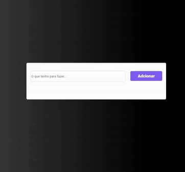

# To Do List

Projeto desenvolvido em React.js com Vite. A aplicação traz a funcionalidade de adicionar tarefas, excluir tarefas, marcar como concluído ou desmarcar.

## Scripts disponíveis

No diretório do projeto, você pode executar: `npm run dev` ou `yarn dev`, para executar o aplicativo no modo de desenvolvimento.
\
Abra [http://localhost:5173](http://localhost:5173) para visualizá-lo em seu navegador.

### Deployment

Acesse o deploy da aplicação online: [https://register-app-aj.netlify.app/](https://register-app-aj.netlify.app/)

## Burguer App

## Tecnologias

- React
- Vite
- UUID
- Styled components
- Git and Github
- Netlify
